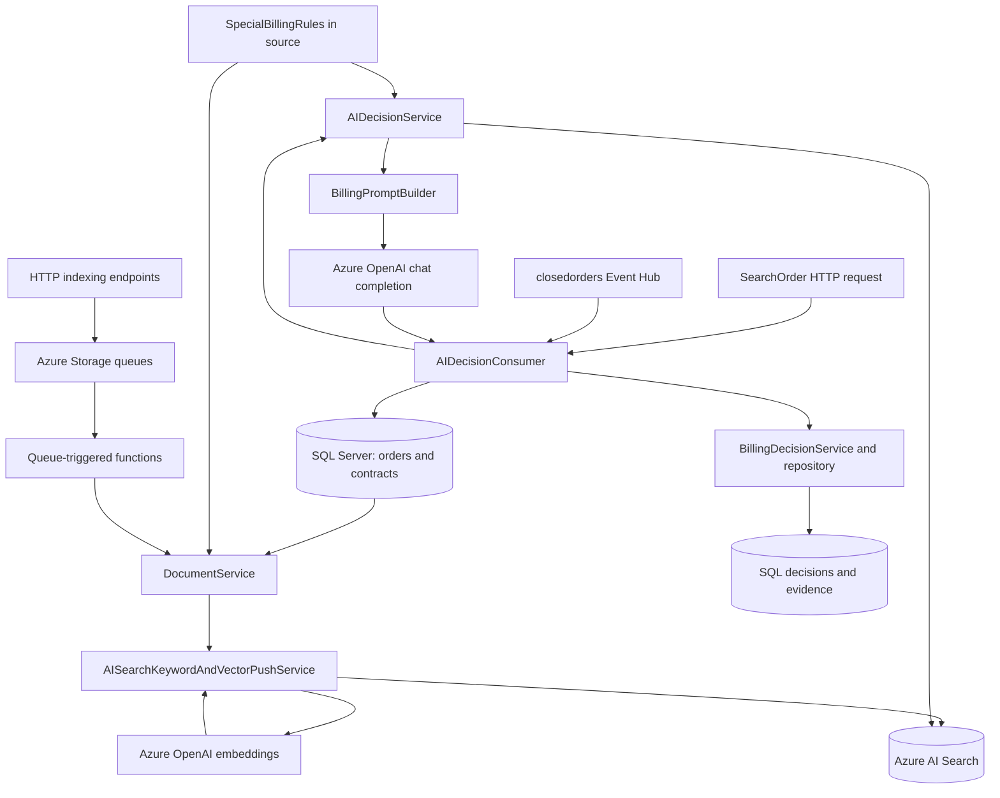

# AIbillingRAGBuilder

A .NET 8 Azure Functions application that builds a retrieval-augmented generation (RAG) knowledge base for billing work orders and produces AI-assisted billing decisions. It combines SQL work orders and contracts, configured billing rules, historical-order search, and an Azure-hosted chat model. Decisions, reasoning, and supporting evidence are written back to SQL Server.

## High-level architecture



### Indexing flow

1. An HTTP function submits a `WorkItem` to `work-items-normal`, or to `work-items-high` for index deletion.
2. Queue-triggered functions dispatch the item to the appropriate indexing worker.
3. `DocumentService` converts SQL work orders or source-defined special rules into `DocumentUnifiedSearchDto` records.
4. The push service generates embeddings from `merged_text` and merges/uploads documents into Azure AI Search.
5. Each logical service uses an index named `<serviceName>-index`, a semantic configuration named `<serviceName>-semantic`, and a `content_vector` field. Use lowercase service names consistently.

Building an index seeds special-rule documents. Historical orders are loaded separately through `AddHistoryData`; individual orders are loaded through `AddData`.

### Billing decision flow

1. An HTTP request or a closed-order event supplies a work-order ID.
2. `DatabaseService` loads the order, its details, and associated contract evidence from SQL.
3. `AIDecisionService` retrieves historical orders using keyword and vector search with semantic ranking. It excludes the current order and filters for historical `Billable` or `Free` decisions.
4. Special rules are selected directly from `SpecialBillingRules.All` using region and trigger-phrase matching. Although rules are indexed, the current decision path does not retrieve them from Azure AI Search.
5. `BillingPromptBuilder` assembles the order, contracts, matching rules, and historical evidence. The chat model returns a JSON decision.
6. `BillingDecisionService` validates basic fields and persists the decision, reasoning, and evidence through `BillingDecisionRepository`.

## Azure Functions reference

There are **12 active functions**: nine HTTP functions, one Event Hub function, and two Storage Queue functions. Routes below include the default `/api` prefix.

### HTTP functions

All HTTP functions use function-key authorization except `Connection`, which is anonymous. For deployed function-authorized endpoints, supply `x-functions-key` or the `code` query parameter.

| Function | Method and route | Inputs | Current behavior |
| --- | --- | --- | --- |
| `Connection` | `GET /api/connection` | None | Returns a connection-test message. It does not verify downstream service health. |
| `LoadData` | `GET /api/LoadData` | None | Queues a data-loading job. The worker reads and materializes order documents; it does not upload them to the index. |
| `AddData` | `POST /api/index/{indexName}?orderid={orderId}` | Logical service name and SQL work-order ID | Queues an order for embedding and merge/upload into `<indexName>-index`. Despite the route parameter name, pass the service name without the `-index` suffix. |
| `DeleteIndex` | `DELETE /api/index/{indexName}` | Logical service name | Queues a high-priority deletion of `<indexName>-index`. |
| `SearchOrder` | `GET /api/searchorder/{serviceName}/{orderId}` | Service name and work-order ID | Runs a billing decision and persists it to SQL. Returns a completion message, not the decision JSON. |
| `SearchBatchOrder` | `GET /api/searchorder/{serviceName}` | Service name | Currently calls the single-argument `ConsumeDecision` overload, which treats this value as an order ID and uses the configured default service. It does **not** invoke the batch implementation. |
| `BuildAIService` | `POST /api/buildaiservice/{serviceName}` | Service name | Queues index creation/update and special-rule seeding. Returns `Order RAG is building.` |
| `AddHistoryData` | `POST /api/addhistorydata/{serviceName}` | Service name | Queues five-day history windows starting January 1, 2025, until the current date. The date range is currently hardcoded. |
| `AIServiceStatusFunction` | `GET /api/AIServiceStatusFunction` | None | Reads in-memory history-indexing results and logs them. Returns `Setting is not done...` when empty, or `Get status done.` otherwise. It does not return a structured job status. |

Queued endpoints return HTTP 200 after enqueueing. A response containing `done` does not mean the background job has completed. Decision GET endpoints write records to SQL and are not read-only search APIs.

### Event Hub function

| Function | Trigger | Behavior |
| --- | --- | --- |
| `ClosedOrderConsumer` | Event Hub `closedorders`, consumer group `$Default`, connection setting `ClosedOrderEventHubConnection` | Deserializes each event as `ClosedOrderEvent`, extracts `WorkOrderId`, and runs/persists a decision using `AzureSearch__ServiceName`. Events in a received batch are processed sequentially. |

Minimal event body for the current consumer:

```json
{
  "EventType": "WorkOrderClosed",
  "WorkOrderId": "12345"
}
```

Use the property casing shown above. The DTO also supports `Code`, `TableName`, `Status`, `UserId`, `ClientDescriptor`, `RemoteIpAddress`, and `OccurredAtUtc`; the consumer currently uses only `WorkOrderId` to select the order.

### Storage Queue functions

| Function | Queue | Behavior |
| --- | --- | --- |
| `ProcessLowWorkQueue` | `work-items-normal` | Handles normal-priority jobs and uses a process-local semaphore to serialize execution. |
| `ProcessHighWorkQueue` | `work-items-high` | Handles high-priority jobs, currently used by index deletion. This separate queue does not preempt work already running. |

Both functions use `AzureWebJobsStorage` and dispatch these work types:

| Work type | Worker action |
| --- | --- |
| `LoadData` | Read and materialize order documents. |
| `DeleteIndex` | Delete the service's search index. |
| `BuildSearchEngine` | Create/update the index and upload special rules. |
| `AddHistoryData` | Load orders for the payload's service/date window, embed, and merge/upload them. |
| `AddData` | Load, embed, and merge/upload one order. |
| `BillingDecision` | Placeholder: delays briefly and logs completion; no AI decision is performed. |
| `Unknown` | Log an unknown-work-type warning. |

`AzureWorkSimpleQueue` serializes work items as JSON and uses Base64 message encoding. `host.json` configures a queue batch size of 1, a five-minute visibility timeout, and a maximum dequeue count of 5. Malformed outer JSON and certain invalid payloads are logged and returned from without throwing, so those cases do not enter exception-driven retry handling.

The commented-out `RebuildOrderRagTimer` is not an active function.

## Main services and supporting functions

| Component | Responsibilities and important methods |
| --- | --- |
| `AISearchKeywordAndVectorPushService` | Queue entry methods (`LoadData`, `StartBuildingAISearch`, `AddData`, `AddHistoryData`, `DeleteIndex`); corresponding worker methods; batched merge/upload, vector generation, and `GetIndexingResults`. |
| `DocumentService` | `GetOrderDocumentAsync`, `GetOrderDocumentsAsync`, `GetContractDocumentsAsync`, and `GetSpecialRuleDocumentsAsync` convert domain data to search documents. Contract conversion exists but is not called by the active index-build path. |
| `DatabaseService` | Initialize lookup data; read full orders, order lines, remarks, contracts, revisions, items, and coverage details from the existing SQL schema. |
| `AIDecisionConsumer` | `ConsumeDecision(orderId)` uses the configured service; `ConsumeDecision(serviceName, orderId)` evaluates and saves one order; `ConsumeDecisions(serviceName)` contains the batch evaluation loop. |
| `AIDecisionService` | `DecideAsync` configures search/chat clients, retrieves historical evidence, matches special rules, requests JSON from the model, and deserializes the result. |
| `BillingPromptBuilder` | `BuildSystemPrompt`, `BuildUserPrompt`, and `BuildOrderSearchText` define the decision instructions, evidence context, and retrieval text. |
| `BillingDecisionService` | `WriteDecisionAsync` saves the decision and evidence; `ReadDecisionAsync` and `ReadDecisionsByPageAsync` reconstruct stored decisions. Read methods have no HTTP endpoint in this project. |
| `BillingDecisionRepository` | SQL access for decisions, reasoning, contract evidence, special-rule evidence, and historical-order evidence. |
| `AzureWorkSimpleQueue` | `EnqueueAsync` selects the priority queue, creates it when needed, and sends the work item. |
| `WorkQueue` / `BackgroundWorkerService` | An in-memory worker path registered in dependency injection. Current indexing endpoints submit to Azure Storage queues instead. |
| `AISearchKeywordOnlyPullService` / `AISearchKeywordAndVectorPullService` | Alternative Blob Storage/indexer-based indexing implementations. They are not wired to the active HTTP build endpoint. |

## Configuration

Use `local.settings.json` for local development and Function App application settings when deployed. Local settings are ignored by Git; `local.settings.sample.json` is the starting template. Never place real credentials in the README or tracked source.

| Setting | Purpose |
| --- | --- |
| `FUNCTIONS_WORKER_RUNTIME` | Set to `dotnet-isolated`. |
| `AzureWebJobsStorage` | Storage connection for the Functions host and both work queues. The sample uses `UseDevelopmentStorage=true`, which requires a running local storage emulator such as Azurite. |
| `Sql__ConnectionString` | Connection to the existing work-order and billing-decision database. |
| `AzureSearch__ServiceUrl` | Azure AI Search endpoint. |
| `AzureSearch__ApiKey` | Search key with permissions to manage indexes and documents. |
| `AzureSearch__ServiceName` | Default logical service name for Event Hub/single-argument decision processing. Add this setting; it is missing from the sample. |
| `AzureSearch__VectorDimensions` | Embedding dimensions; defaults to `1536`. Must match the selected embedding deployment. |
| `AzureSearch__VectorSearchProfileName` | Vector profile prefix; defaults to `vector-profile`. |
| `AzureSearch__VectorAlgorithmConfigurationName` | HNSW configuration name; defaults to `myHnsw`. |
| `AzureSearch__VectorizerName` | Search-side vectorizer name; defaults to `myFoundry`. |
| `AzureSearch__BLOBStorageConnectionString` | Used by alternative pull/indexer implementations; not required by the active push workflow. |
| `Foundry__ServiceUrl` | Azure OpenAI-compatible resource endpoint used for embedding and chat clients. |
| `Foundry__ApiKey` | Credential for that resource. |
| `Foundry__EmbeddingDeploymentName` | Deployed embedding-model name. |
| `Foundry__EmbeddingModelName` | Embedding model identifier for the search-side vectorizer. |
| `ClosedOrderEventHubConnection` | Connection for the `closedorders` Event Hub. Add it when enabling the event consumer; it is missing from the sample. |

The chat deployment is currently hardcoded as `zhb-gpt-5.6-sol` in `Services/Decision/AIDecisionService.cs`. Change that value to an existing compatible deployment before running billing decisions. It is not currently configurable through `FoundryOptions`.

## Run locally

Prerequisites:

- .NET 8 SDK and Azure Functions Core Tools v4.
- Azure Storage or a local emulator for host storage and queues.
- Azure AI Search with vector search and semantic ranking configured for this workflow.
- Azure-hosted embedding and chat deployments accessible to the application and search vectorizer.
- The existing SQL work-order schema and decision tables. This repository does not include a tracked database migration/bootstrap script.
- Event Hub connection settings, or a locally disabled Event Hub function when testing HTTP/queue workflows only.

From the repository root:

```powershell
# Only copy the template if you do not already have local settings.
if (-not (Test-Path local.settings.json)) {
    Copy-Item local.settings.sample.json local.settings.json
}

dotnet restore AIbillingRAGBuilder.csproj
dotnet build AIbillingRAGBuilder.csproj

# Fill in local settings and start your storage emulator if applicable first.
func start
```

For HTTP/queue-only local testing, add `"AzureWebJobs.ClosedOrderConsumer.Disabled": "true"` under `Values` in local settings. For event processing, configure its connection and default service name instead.

### Example workflow

These PowerShell requests assume the local host listens on port 7071 and that SQL contains the supplied order ID.

```powershell
$baseUrl = 'http://localhost:7071/api'
$serviceName = 'billing'
$orderId = '12345'

Invoke-RestMethod "$baseUrl/connection"
Invoke-RestMethod -Method Post "$baseUrl/buildaiservice/$serviceName"

# Wait for queue processing and confirm index creation in logs/search before continuing.
Invoke-RestMethod -Method Post "$baseUrl/index/${serviceName}?orderid=$orderId"

# Optional: queues the entire configured historical range, not just one order.
# Invoke-RestMethod -Method Post "$baseUrl/addhistorydata/$serviceName"

# Wait for indexing to finish before requesting a decision.
Invoke-RestMethod "$baseUrl/searchorder/$serviceName/$orderId"
```

The final call writes its result to SQL and returns a text acknowledgement. Inspect application logs or the decision tables for the actual result.

## Persistence

The repository uses these output tables:

- `dbo.eAiBillingDecisionResponse`
- `dbo.eAiBillingReasoning`
- `dbo.eAiContractEvidence`
- `dbo.eAiSpecialRuleEvidence`
- `dbo.eAiHistoryEvidence`

Input queries depend on an existing business schema, including work orders, stores, users, contracts, contract items, revisions, and coverage data. See `DatabaseService` for the exact schema assumptions and `BillingDecisionRepository` for output columns.

## Current implementation notes

- The batch HTTP endpoint is wired to the single-order overload. The separate batch method also calls `Get100FullOrdersAsync`, whose implementation currently returns at most one order via `Take(1)`.
- Indexing status is in-memory, tied to a worker instance, and primarily updated by historical-order loading. It is not a durable job-status API.
- Decision writes span multiple repository calls without an encompassing transaction or event-deduplication mechanism. Repeated requests/events can create repeated decision records.
- The decision path requests JSON output, but a JSON parsing failure returns a default response object. It does not explicitly produce a review-required result for that failure.
- `DatabaseService` currently logs its SQL connection string during construction/initialization. Remove or redact those log statements before using sensitive connection strings with shared logs.
- The singleton indexing service depends on scoped `IDocumentService`; review this lifetime relationship if dependency-injection scope validation is enabled.
- No automated test project is included. Local end-to-end validation requires the configured external services and compatible SQL data.

## Project layout

```text
OrderRagIndexFunction.cs        HTTP and Event Hub entry points
Program.cs                     Host startup, dependency injection, options
host.json                      Functions host and queue settings
Services/                      Indexing, documents, SQL reads, prompts, persistence service
Services/Decision/             Billing decision orchestration and model calls
Workers/                       Azure queues, trigger functions, in-memory workers
Repo/                          SQL persistence for decisions and evidence
Dtos/                          Configuration, event, order, contract, and search DTOs
Models/                        Billing decisions, evidence, and rule models
Datas/SpecialBillingRules.cs    Source-defined billing rules
Properties/                    Local launch and Azure service dependency metadata
local.settings.sample.json     Local configuration template
```
